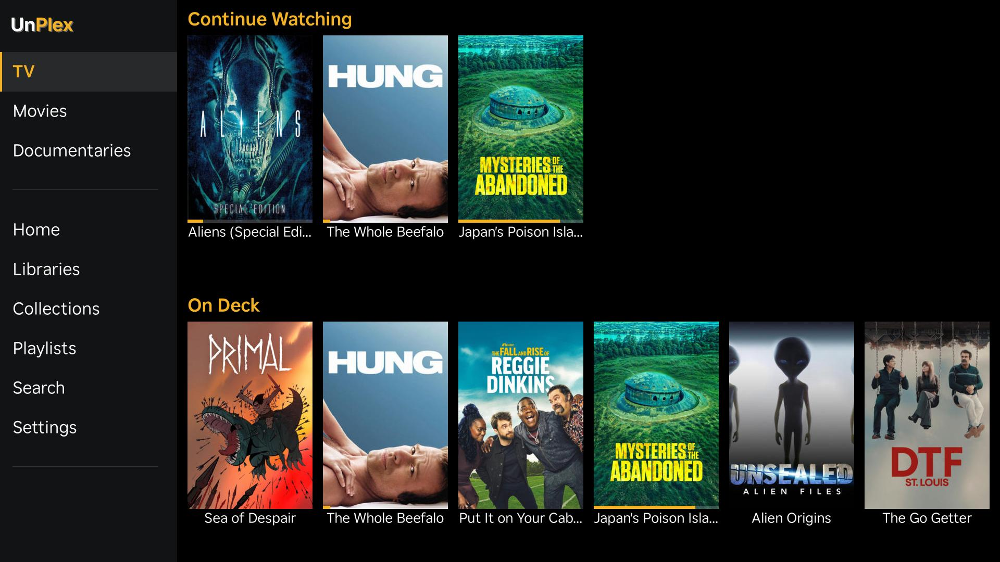
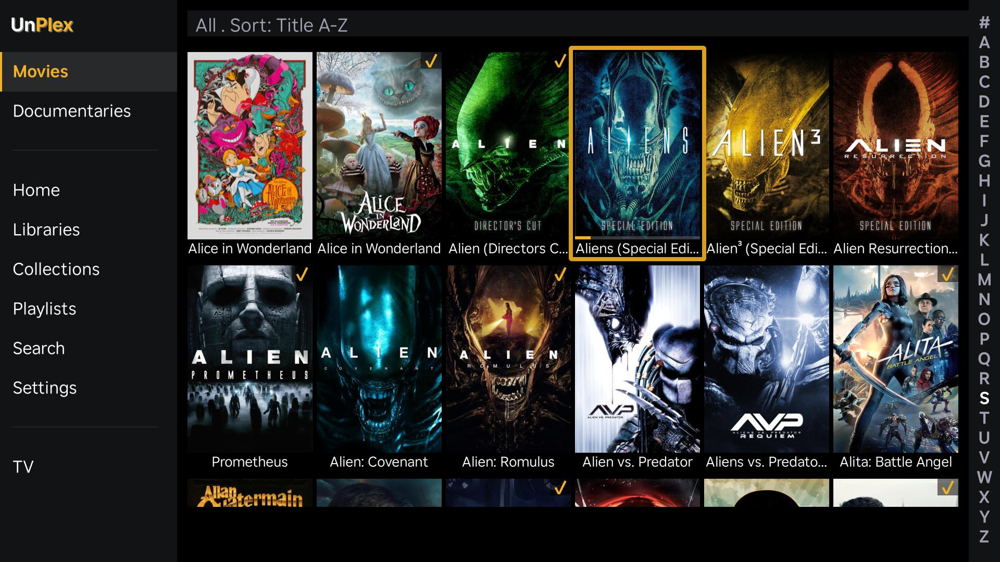
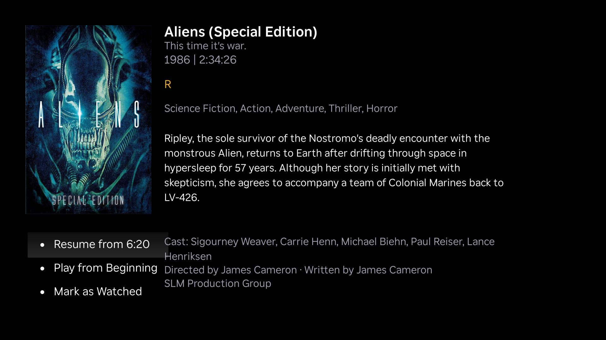
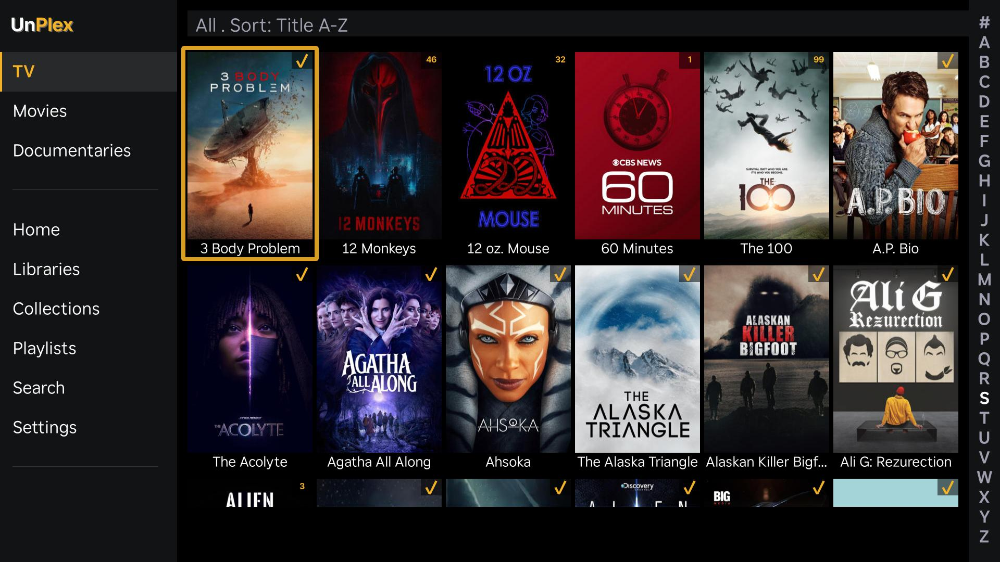
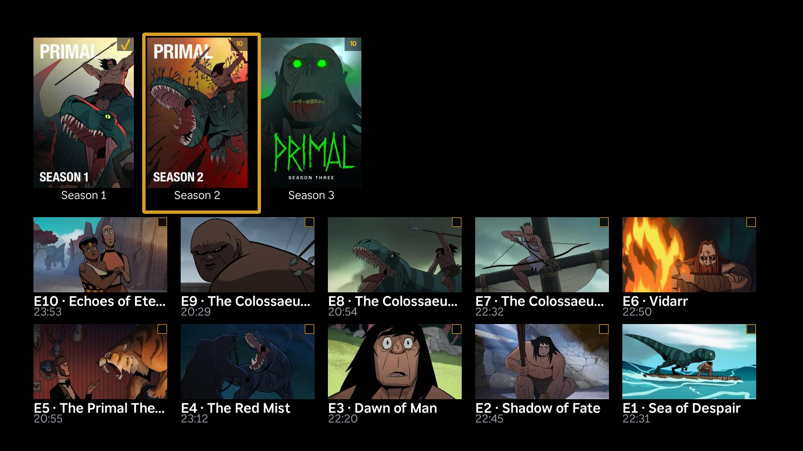
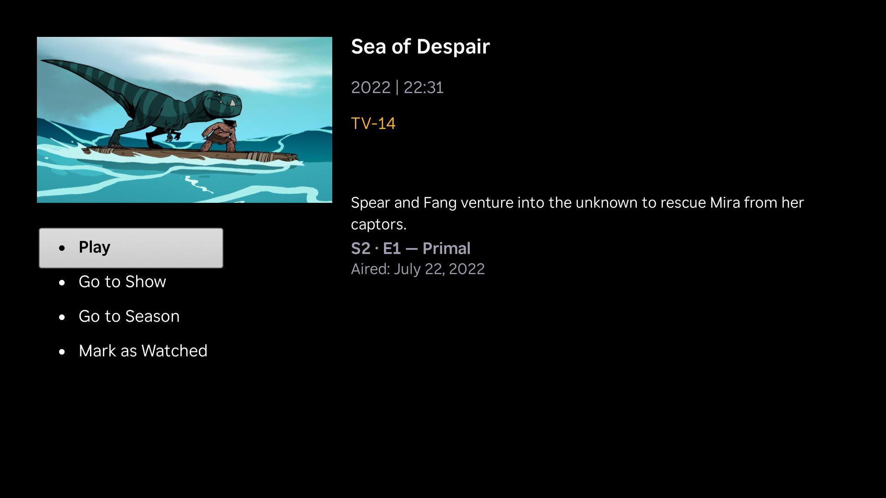
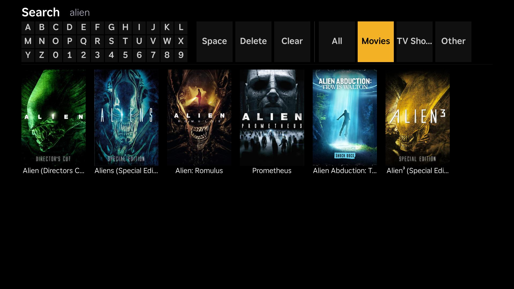
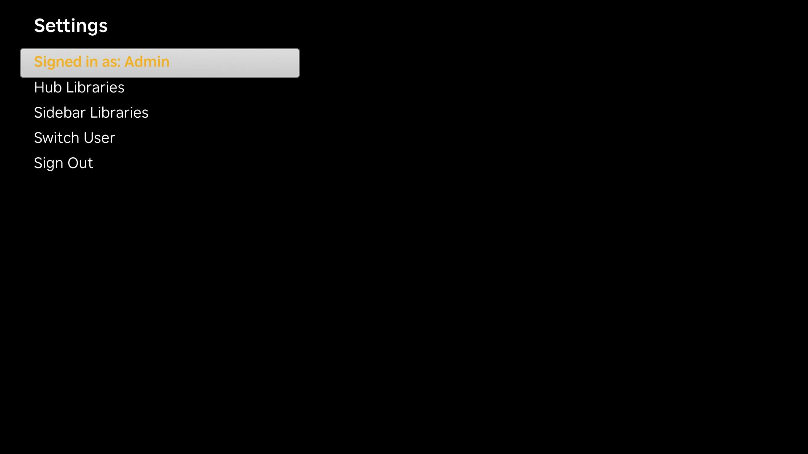

# UnPlex

A side-loadable Roku channel that serves as a custom Plex Media Server client. UnPlex replaces the official Plex Roku app with a clean, fast, grid-based UI inspired by the classic "Plex Classic" Roku client — sidebar navigation, poster grids, and direct access to your media without fighting the interface.

Built with BrightScript and Roku SceneGraph for FHD (1920×1080)+ displays.

## What UnPlex Is

UnPlex is a **lightweight, general-purpose Plex client** that covers the essential bases without overhead. It focuses on the core media experience — browsing, searching, and playing your library content — with a fast, grid-based UI designed for Roku's remote control.

- Browse movies, TV shows, and music with poster grids and hub rows
- Direct play with automatic transcode fallback
- Resume playback, track selection, skip intro/credits, auto-play next episode
- PIN-based authentication via plex.tv/link with managed user switching
- Customizable Hub and Sidebar — choose which libraries appear and in what order

## What UnPlex Is Not

- **Not a full-featured Plex client replacement.** UnPlex covers the core browsing and playback experience. Advanced Plex features like live TV, DVR, Discover, Watchlist, shared libraries from other users, and Plex-hosted streaming content (Movies & TV, Music) are not supported.
- **Not a channel store app.** UnPlex is side-loaded onto your Roku in developer mode. It is not published to the Roku Channel Store and there are no plans to submit it.
- **Not a multi-server client.** UnPlex connects to a single Plex Media Server. If you have multiple servers, it will use the first one it discovers.

## Disclaimer

> **UnPlex is provided as-is.** It has not been broadly tested across Roku hardware models, Plex library configurations, or media formats. You may encounter bugs, playback failures, or unexpected behavior. If you find an issue, please [open a bug report](https://github.com/pdxred/UnPlex/issues/new) — reports that include your Roku model, firmware version, and steps to reproduce are especially helpful.

## Screenshots

**Hub View**


**Movies Library**


**Movie Detail**


**TV Library**


**TV Seasons & Episodes**


**Episode Detail**


**Search**


**Settings**


## Features

**Library Browsing**
- Browse movies, TV shows, and music libraries with poster grid layouts
- Hub rows: Continue Watching, Recently Added, On Deck
- Collections and playlists browsing
- Filter and sort by genre, year, unwatched status, and sort order
- Sidebar navigation for quick library switching

**Media Management**
- Delete media items from your library (with confirmation dialog)
- Get Info — view detailed technical metadata (codecs, resolution, bitrate, file size) via the MediaInfoScreen
- Watched/unwatched badges and progress bar overlays on poster items

**Playback**
- Direct play with automatic transcode fallback (HLS)
- Resume from last playback position
- Audio track selection during playback
- Subtitle track selection (SRT sidecar + PGS burn-in)
- Track preference persistence across sessions
- Skip Intro and Skip Credits buttons
- Auto-play next episode with countdown

**User Management**
- PIN-based OAuth authentication via plex.tv/link
- Managed user switching with PIN entry
- Persistent authentication across sessions

**Search**
- Debounced search queries across all libraries
- Results displayed by media type

**Settings**
- Customize Hub Libraries — choose which libraries contribute Continue Watching, Recently Added, and On Deck rows
- Customize Sidebar Libraries — pin, unpin, and reorder libraries in the sidebar
- App version displayed in Settings (About row)

## Installation

UnPlex is installed by side-loading it onto a Roku device in developer mode. No channel store submission is required.

### 1. Enable Developer Mode on Your Roku

1. Using your Roku remote, press: **Home** (3×), **Up** (2×), **Right**, **Left**, **Right**, **Left**, **Right**
2. The Developer Settings screen will appear
3. Enable the installer and set a developer password
4. Note your Roku's IP address (Settings → Network → About)

### 2. Build the Channel Package (Or just download the desired UnPlex[version].zip from the repo root and skip to manual upload)

Make sure you have [Node.js](https://nodejs.org/) installed, then:

```bash
git clone https://github.com/pdxred/UnPlex.git
cd UnPlex
npm install
npm run build
```

### 3. Side-Load to Your Roku

**Option A — Automated deploy:**

```bash
npm run deploy
```

This uses [roku-deploy](https://github.com/RokuCommunity/roku-deploy) to build, package, and install to your Roku in one step. Configure the target Roku IP and password in `bsconfig.json`.

**Option B — Manual upload:**

1. Open a web browser and navigate to `http://<your-roku-ip>` (the Roku developer web installer on port 80)
2. Log in with the developer password you set in step 1
3. Upload the `UnPlex.zip` file through the installer page
4. The channel will install and launch automatically

### 4. Authenticate with Plex

1. On first launch, UnPlex displays a PIN code
2. Visit [plex.tv/link](https://www.plex.tv/link) on any device and enter the PIN
3. UnPlex automatically discovers your Plex Media Server and begins loading your libraries

### 5. Verify It Works

After authentication, you should see the Hub view with Continue Watching, Recently Added, and On Deck rows populated from your pinned libraries. Navigate to a library using the Sidebar to confirm library browsing works, and try playing a media item to verify playback.

## Usage

### Remote Control

| Button | Action |
|--------|--------|
| **OK** | Select / Confirm |
| **Back** | Go to previous screen |
| **Left/Right** | Navigate sidebar / grid columns |
| **Up/Down** | Navigate grid rows / lists |
| **Play/Pause** | Toggle playback |
| **Options (*)** | Context menu (audio/subtitle selection) |

### The Hub View

The Hub is the home screen you see after authentication. It displays media rows drawn from your pinned libraries:

- **Continue Watching** — media you've started but not finished
- **Recently Added** — newly added items across your libraries
- **On Deck** — next episodes to watch in shows you're following

By default, all libraries contribute to the Hub. To customize which libraries appear:

1. Navigate to **Settings** from the Sidebar
2. Select **Hub Libraries**
3. Use the list to pin or unpin libraries — only pinned libraries will contribute rows to the Hub
4. Reorder pinned libraries to control the display order

### The Sidebar

Press **Left** from any screen to open the Sidebar. It contains:

- **Home** — returns to the Hub view
- **Your pinned libraries** — quick access to each library's poster grid
- **On Deck** — jump to your On Deck items
- **Search** — search across all libraries
- **Settings** — app settings and customization

To customize which libraries appear in the Sidebar and their order:

1. Navigate to **Settings** from the Sidebar
2. Select **Sidebar Libraries**
3. Pin or unpin libraries to control which appear in the Sidebar
4. Reorder pinned libraries to set the navigation order

### Library Browsing

Select a library from the Sidebar to view its content in a poster grid. From any library screen:

- Use **filter/sort options** to narrow results by genre, year, or watched status
- For **TV shows**, click a show to see season posters in a scrollable row, then select a season to browse episodes as landscape thumbnail cards in an episode grid below
- For **movies and episodes**, select an item to view its detail screen showing tagline, cast, director, studio, and other metadata

### Detail Screens

Detail screens show full metadata for a media item and provide these actions:

- **Play** — start playback (resumes from last position if applicable)
- **Get Info** — open the MediaInfoScreen showing technical metadata (codecs, resolution, bitrate, file size, audio channels, subtitle streams)
- **Delete** — remove the media item from your library (with a confirmation dialog)

### Playback

- Select any movie or episode to view its detail screen, then press **Play** or **OK** to start playback
- Playback resumes from your last position automatically
- Press **Options (*)** during playback to select audio tracks or subtitles
- Skip Intro and Skip Credits buttons appear automatically when markers are available
- For TV shows, the next episode plays automatically after a countdown at the end of the current episode

### Search

Select **Search** from the Sidebar. Type to search across all libraries — results are grouped by media type (movies, shows, episodes) with debounced queries so results update as you type.

## Building from Source

### Prerequisites

- [Node.js](https://nodejs.org/) (LTS recommended)
- A Roku device in developer mode (for testing)

### Setup

```bash
git clone https://github.com/pdxred/UnPlex.git
cd UnPlex
npm install
```

### Available Scripts

| Command | Description |
|---------|-------------|
| `npm run build` | Compile BrighterScript source via `bsc` |
| `npm run deploy` | Compile and deploy to a Roku device via `bsc --deploy` |
| `npm run lint` | Run BrighterScript linter (no output) via `bsc --noEmit` |

### Project Structure

```
UnPlex/
├── manifest                 # Roku app manifest (version, icons, settings)
├── source/                  # Main BrightScript source files
│   ├── main.brs            # Entry point — screen creation and message loop
│   ├── utils.brs           # Shared helpers (auth, URLs, HTTP, formatting)
│   └── constants.brs       # Colors, sizes, API constants
├── components/              # SceneGraph components
│   ├── MainScene.xml/.brs  # Root scene and screen stack management
│   ├── screens/            # Full-screen views (Home, Detail, Show, Search, Settings, PostPlay, Playlist, PIN, UserPicker, MediaInfo)
│   ├── widgets/            # Reusable UI (Sidebar, PosterGrid, VideoPlayer, EpisodeGrid)
│   └── tasks/              # Background Task nodes for HTTP requests
├── fonts/                   # Bundled fonts (Inter Bold)
└── images/                  # App icons, splash screen, placeholders
```

### Build Configuration

The BrighterScript compiler is configured via `bsconfig.json`:
- **Input:** `UnPlex/manifest`, `UnPlex/source/**/*.brs`, `UnPlex/components/**/*`
- **Output:** `out/staging` (generated at build time, not committed)
- Source maps are enabled for debugging

## Architecture

UnPlex is built on Roku's SceneGraph framework. Each UI component is a pair of files: an `.xml` file defining layout and interface fields, and a `.brs` file containing the component's logic.

**Key architectural patterns:**

- **Screen stack** — MainScene maintains an array of screen nodes. The Back button pops the stack, preserving focus position when returning to previous screens.
- **Task-based HTTP** — All network requests run in background Task nodes (`PlexAuthTask`, `PlexApiTask`, `PlexSearchTask`, `PlexSessionTask`) to avoid render-thread blocking.
- **Observer pattern** — Task nodes communicate results to UI components via field observers, enabling asynchronous data flow.
- **ContentNode trees** — All lists and grids are populated through Roku's ContentNode data model.
- **Registry persistence** — User settings and authentication tokens are stored in `roRegistrySection("UnPlex")`.

For a detailed technical breakdown, see [docs/ARCHITECTURE.md](docs/ARCHITECTURE.md).

## Contributing

Contributions are welcome! Whether it's a bug fix, a new feature, or a documentation improvement, we'd love your help. See [CONTRIBUTING.md](CONTRIBUTING.md) for development setup, coding conventions, and how to submit a pull request.

## Bug Reports

Found a bug? [Open an issue](https://github.com/pdxred/UnPlex/issues/new) on GitHub. Including your Roku model, firmware version, and steps to reproduce helps us fix it faster. If the issue involves playback or UI glitches, see [docs/DEBUG-LOGS.md](docs/DEBUG-LOGS.md) for how to collect debug logs from your device.

## Changelog

See [CHANGELOG.md](CHANGELOG.md) for a history of releases and notable changes.

## License

UnPlex is released under the [MIT License](LICENSE).

This project includes [Inter](https://rsms.me/inter/) Bold font by Rasmus Andersson, licensed under the [SIL Open Font License 1.1](https://openfontlicense.org/).

## Acknowledgments

- [Plex](https://www.plex.tv/) — Media server platform and API
- [Inter](https://rsms.me/inter/) by Rasmus Andersson — UI typeface (SIL Open Font License)
- [Roku Developer Platform](https://developer.roku.com/) — SceneGraph framework and documentation
- [BrighterScript](https://github.com/RokuCommunity/brighterscript) — Enhanced BrightScript compiler
- [roku-deploy](https://github.com/RokuCommunity/roku-deploy) — Deployment tooling
